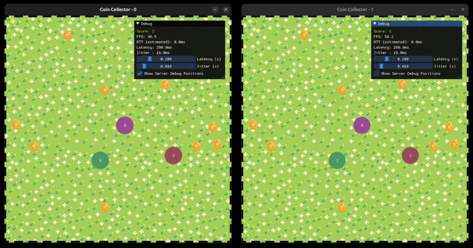

# Coin Collector Game

A real-time multiplayer Coin Collector game using Python, UDP, and OpenGL (via glfw/imgui).

## Demo
<p align="center">
  
</p>

## Requirements

- Python 3.11+
- `glfw`
- `imgui[glfw]`
- `PyOpenGL`
- `Pillow`

## Setup

1. Create a virtual environment:

   ```bash
   # Create virtual environment, use 3.11+
   python3.11 -m venv venv

   # Activate virtual environment
   source venv/bin/activate  # Linux/Mac
   venv\Scripts\activate  # Windows
   ```

2. Install dependencies:

   ```bash
   pip install -r requirements.txt
   ```

## Running the Game

### 1. Start the Server

```bash
python server.py
```

The server listens on port 9999.

### 2. Start Clients

Open multiple terminal windows and run:

```bash
python client.py 1 # Client 1

python client.py 2 # Client 2
```

## Features

- **Authoritative Server**: Handles movement, collisions, and scoring.
- **UDP Networking**: Fast, real-time communication.
- **Client-Side Prediction**: Predicts movement based on inputs.
- **Interpolation**: Smooth movement of remote players.
- **Latency Simulation**: Simulates network delay and jitter.
- **Reconciliation**: Client corrects its position based on server updates.

## Controls

- **Arrow Keys**: Move
- **Debug UI**: Adjust simulated latency.

## Game Assets

Adapted from:

- [Grass Background](https://depositphotos.com/vector/grass-pixel-art-background-flower-garden-575075648.html)
- [Coin](https://www.freepik.com/free-vector/video-game-coin_136488507.html)

## References

- [Overwatch Gameplay Architecture and Netcode, Tim Ford, GDC 2017](https://www.youtube.com/watch?v=W3aieHjyNvw&t=2275s)
- [Networking for Virtual Worlds](https://youtube.com/playlist?list=PLoRL6aS9crowO6h2SL7k9lUV5eeC6uqnx&si=XM3P13_WeqbMQINY)
- [Game Networking Articles by Glenn Fiedler](https://gafferongames.com/categories/networking/)